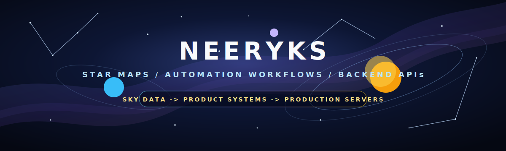

<div align="center">



# Akashdeep Singh / neeryks

### I build star maps, automation flows, backend APIs, and web systems that feel alive.

I like turning sky data, business ideas, and messy workflows into products people can actually use. A lot of my work lives somewhere between astronomy visuals, clean interfaces, backend logic, automation, and the quiet server work that keeps everything running.

[](https://neeryks.dev)
[](https://stellix.app)
[](https://vedkosh.app)
[](https://openmapper.app)
[](https://openmapper.app/saas)

</div>

## Cosmic Console

```txt
                 neeryks.dev
                     |
        Stellix.app  |  Vedkosh.app
             \       |       /
              \      |      /
               OpenMapper systems
                     |
        automation  APIs  servers  launch
```

My main orbit is space software. I care about star maps, night sky generators, celestial visuals, location and date based sky products, and web experiences that make cosmic data feel close enough to touch.

OpenMapper is the engine room behind a lot of that work. It covers websites, ecommerce, automation flows, SaaS APIs, backend contracts, domains, deployments, Linux servers, and production support.

## What I Build

**Stellix.app**<br>
Custom star map posters with night sky generation, personalization, ecommerce flow, and output ready for print.

**Vedkosh.app**<br>
A Vedic astrology workspace for kundli, divisional charts, dashas, Panchang, transits, and chart connected tools.

**OpenMapper.app**<br>
Websites, ecommerce, backend APIs, automation flows, lead systems, and SaaS style product modules.

**neeryks.dev**<br>
My personal base on the web.

## Automation Flows

```txt
visitor form        orbit check        CRM or report        action
business data       clean signal       summary              dashboard
product order       process            status update        delivery
```

I enjoy building the invisible rails around a product. The quiet flows that catch leads, clean inputs, move data between tools, send updates, create reports, trigger actions, and remove boring manual steps.

## Backend And SaaS APIs

OpenMapper also carries backend modules for product and business automation.

```txt
StarMapper API          star map generation, orders, and fulfillment flow
EarthMapper API         location memory maps and geographic story products
Memory eBook API        personalized digital story products
Astro Calendar API      yearly astronomy calendar generation
Appointment API         booking, rescheduling, and availability checks
AI CRM API              CRM records, search, updates, and cleanup
Lead Capture API        lead extraction, scoring, and CRM handoff
Business Reporting API  summaries, metric snapshots, and trend notes
```

## Stack In Orbit

<p align="center">
  
</p>

```txt
space        star maps | sky charts | celestial data | printable outputs
automation   lead capture | CRM | scheduling | reports | AI flows
backend      Python | Node.js | APIs | forms | data flows | business logic
frontend     React | TypeScript | JavaScript | HTML | CSS | Tailwind
servers      Linux | SSH | Nginx | SSL | DNS | Docker | deployments
```

## Current Orbit

```txt
active  make space and star map products the main lane
active  grow Stellix.app as the flagship star map product
active  build more automation around products and businesses
active  keep improving OpenMapper backend and API modules
active  keep Vedkosh.app serious, useful, and deep
active  keep production systems fast, clean, and reliable
```

<div align="center">

```txt
        .          *             .        *
   *          building under a quiet sky          .
        .          *             .        *
```

### Main orbit: [neeryks.dev](https://neeryks.dev) / [Stellix.app](https://stellix.app) / [OpenMapper.app](https://openmapper.app)

</div>
